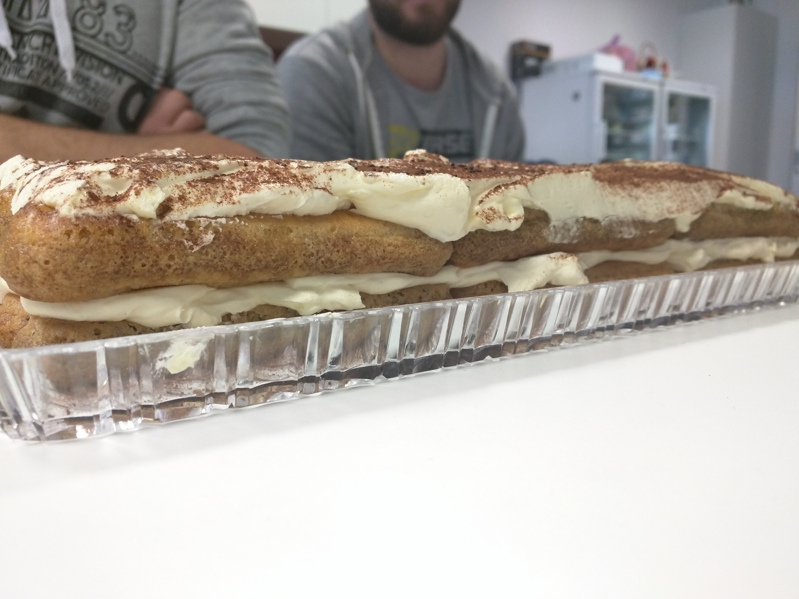

## A word from the engineering team
Would you like to know more about us? What we work on? How we work? Read through this repository to get a better understanding of our team culture.

If you think **JavaScript** is the present and the future, we welcome you to our full stack development team.

### About the team
We are a growing team of professionals focusing our skills and efforts around the JavaScript ecosystem (and not only). We work in a collaborative way on [multiple projects](https://github.com/FortechRomania/js-team-showcase/blob/master/showcase/our-work.md), while still making sure everyone in the team adheres to our common vision and culture.

We wanted to write a few lines about the team name “Cake for Breakfast” but it’s self-explanatory anyway and we were too busy... 👇

Ah, and this is our logo.

### What we do
We work on various projects from vanilla **JavaScript**, to REST APIs with **Express** and **Koa**, to complex front-end applications with **React** and **Angular** and native mobile applications with **React Native**. We are pushing the limits of the web and mobile every day and we challenge each other to come up with the best solutions for our customers.

### How we do it
We have a strong [team culture](https://github.com/FortechRomania/js-team-showcase/tree/master/team) built around a few core values.

We believe in mentoring, teaching and sharing information. One of our training activities is the [junior development program](https://github.com/FortechRomania/js-team-showcase/tree/master/we-train/junior-development-program), but we are also involved in running [nodeschool workshops](https://github.com/FortechRomania/js-team-showcase/tree/master/we-train/node-school) in **Cluj**.

Also, to keep track of the ever changing technology spectrum we consume allot of programming related [articles](https://github.com/FortechRomania/js-team-showcase/blob/master/we-recommend/daily-bookmarks.md), [books](https://github.com/FortechRomania/js-team-showcase/blob/master/we-recommend/books.md) and [videos](https://github.com/FortechRomania/js-team-showcase/blob/master/we-recommend/talks.md).
